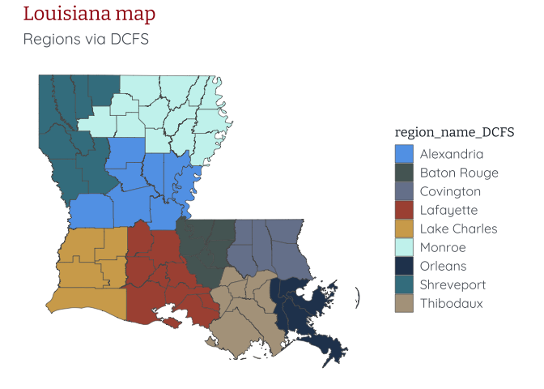

<!-- README.md is generated from README.Rmd. Please edit that file -->

# blancocentR

<!-- badges: start -->
<!-- badges: end -->

The goal of blancocentR is to facilitate easy mapping of Louisiana’s 64
parishes and various region designations, as well as to allow for
cohesive data visualizations across the Blanco Center using the Blanco
Center theme and colors.

## Installation

You can install the development version of blancocentR from
[GitHub](https://github.com/) with:

``` r
# install.packages("pak")
pak::pak("claudia-laurenzano/blancocentR")
```

## Example

This is a basic example of how you can use the `louisiana` data, the
Blanco Center theme, and Blanco Center colors specific to DCFS regions:

``` r
library(blancocentR)
library(ggplot2)

data(louisiana)
ggplot(louisiana) + 
  geom_sf(aes(fill = region_name_DCFS)) + 
  scale_fill_manual(values = dcfs_palette()) + 
  labs(title = "Louisiana map",
       subtitle = "Regions via DCFS") +
  theme_bc(void = TRUE) + 
  theme(legend.position = "right")
```


